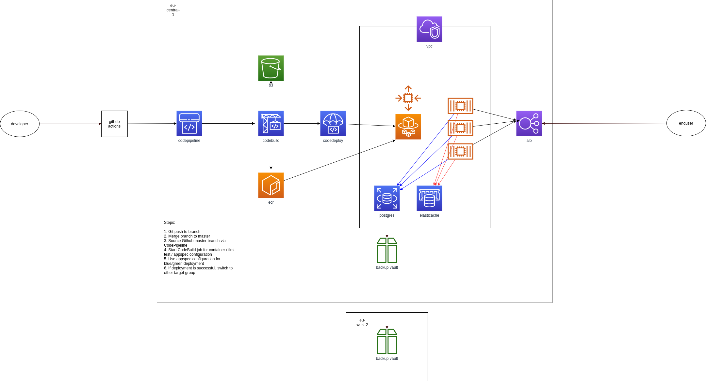
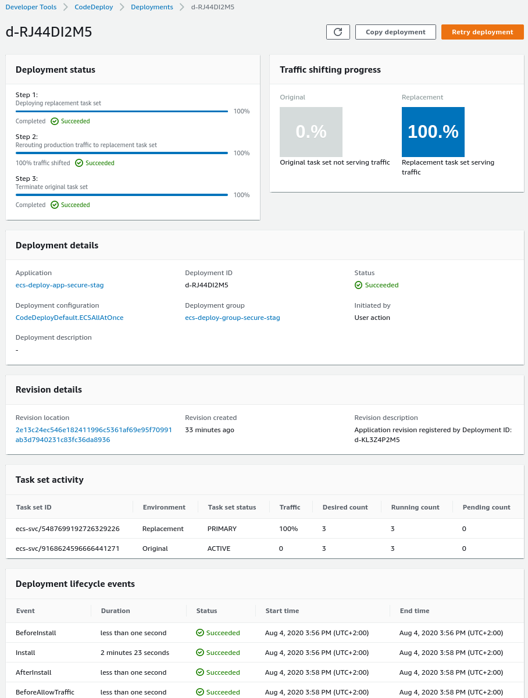
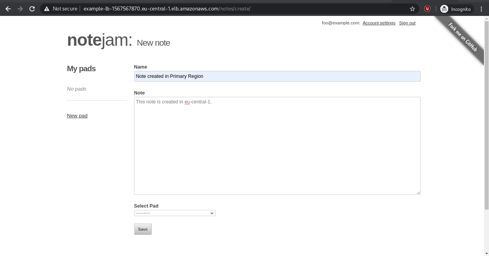
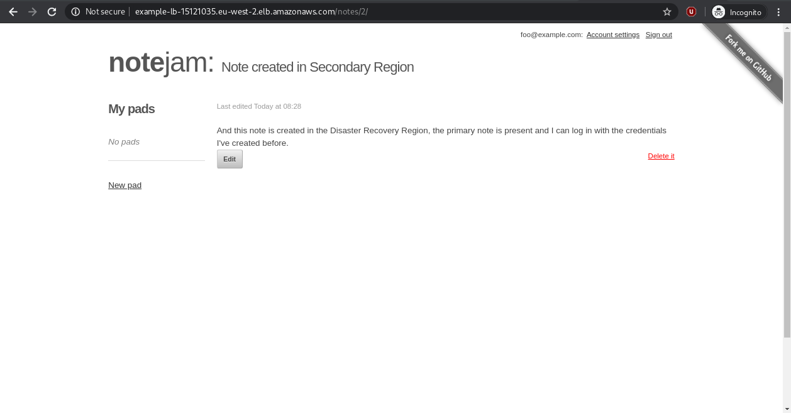
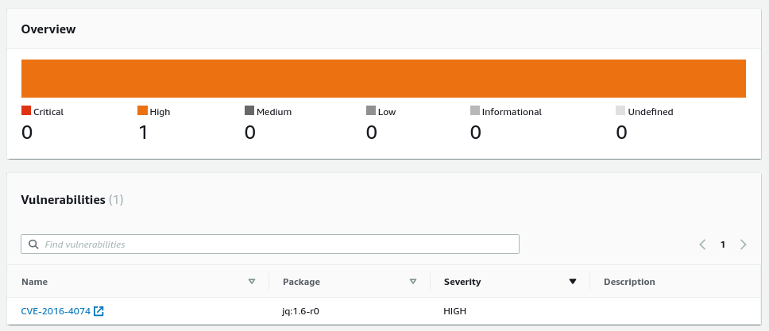

## Overview

### Architecture Overview



## Notejam

I've picked the Django Flavor of Notejam, simply because that a framework I've worked with the most.

Notejam is a webapplication which relies on a database and a cache. Both the database and cache can run on the same system where Notejam is hosted, but for production environments, both the webserver, the database and cache should live on separate systems.

I've picked ECS Fargate to run the Notejam application, packaged in a docker container, with RDS (Postgres9.6) and ElastiCache (Memcached). 

## Deployment

To deploy the entire stack, make sure you've set up a [github PAT](hhttps://docs.aws.amazon.com/codepipeline/latest/userguide/GitHub-create-personal-token-CLI.htmlttp) first, and then create an AWS Secrets Manager Secret, with some Django-specific configuration.

Next, clone the repository from https://github.com/wbongithub/techassessment

The preseed secret will contain the Django Secret Key (which should be identical for every container, its used for database migrations), a username/password for the RDS instance and credentials for the Django Super User.

```shell script
git clone https://github.com/wbongithub/techassessment
cd techassessment
cat db_preseed.json
{
  "django_secret_key": "g+cy2q816xje*f#k=9z!e*t%h-7tt(tbo$q^1n)l0gd1=x8$65",
  "db_username": "exampleuser",
  "db_password": "examplepassword",
  "django_admin_user": "admin",
  "django_admin_password": "password",
  "django_admin_mail": "foo@bar.com"
}

aws secretsmanager create-secret --name DjangoPreseedConfig --description "Django Preseed Configuration" --secret-string file://db_preseed.json --region eu-central-1
```

p.s. I'm using the `django_secret_key` from the [original project](https://github.com/komarserjio/notejam/blob/master/django/notejam/notejam/settings.py#L82), its recommended to change it in a production environment.


### Primary Deployment Procedure

Next, we're going to deploy the Core stack in the default/primary region.

```shell script
terraform init
terraform workspace new eu-central-1
terraform apply -var="region=eu-central-1" -var="github_owner=furhouse" -var="github_repo=notejam" -var="github_token=xyz" -var="account_id=123"
cd aws_backup
terraform init
terraform apply -var="primary_region=eu-central-1" -var="disaster_recovery_region=eu-west-2"
```

### Disaster Recovery Deployment Procedure

Since its possible to create an `aws_db_instance` resource with an empty string for its `snapshot_identifier`, we just need to set that value while deploying the entire application in the disaster recovery region.

Via the `aws cli`, fetch the latest snapshot identifier in the disaster recovery region and create the preseed configuration. Then switch to a new `terraform` workspace, and run `terraform apply`, specifying the disaster recovery region, the snapshot identifier and the other required variables:
```shell script
aws rds describe-db-snapshots --region eu-west-2
aws secretsmanager create-secret --name DjangoPreseedConfig --description "Django Preseed Configuration" --secret-string file://db_preseed.json --region eu-west-2
terraform workspace new eu-west-2
terraform apply -var="region=eu-west-2" -var="db_snapshot_identifier="awsbackup:copyjob-84af9ab2-66ca-1b2a-52d3-1b32e9b82acc" -var="github_owner=furhouse" -var="github_repo=notejam" -var="github_token=xyz" -var="account_id=123"
```

## Development

Simply push your changes to a branch, and when its merged to master, the deployment pipeline starts :-)

A `docker compose` file is also included, which can be used for local development.

## Cleanup

If the AWS Backup Vault contains Recovery Points (backups stored in a Backup Vault), make sure to remove those first (in both regions).

```shell script
terraform workspace select eu-central-1
cd aws_backup
terraform destroy -var="primary_region=eu-central-1" -var="disaster_recovery_region=eu-west-2"
cd ..
terraform destroy -var="region=eu-central-1" -var="github_owner=furhouse" -var="github_repo=notejam" -var="github_token=xyz" -var="account_id=123"
terraform workspace select eu-west-2
terraform destroy -var="region=eu-west-2" -var="github_owner=furhouse" -var="github_repo=notejam" -var="github_token=xyz" -var="account_id=123"
```

## Components
* GitHub Repository for application code
* GitHub Private Access Token for fetching source via CodePipeline
* GitHub Actions Workflow for running test jobs
* CodeBuild/CodePipeline for CI/CD with ECS and Blue/Green deployments
* Cloudwatch Alarms and Log Groups
* RDS with encrypted storage (just in 1 AZ right now, in a private subnet)
* ElasiCache Memcached for session storage (just in 1 AZ right now, in a private subnet)
* AWS Backup Vault in 2 regions with Replication between primary and disaster recovery region
* ECR with Image Scanning for vulnerabilities
* AWS Secrets Manager Secret for Django Configuration
* Docker Compose files for quickly setting up a local development environment

### Screenshots

#### A screenshot of the CodeDeploy Application Deployment


#### A screenshot of a note created in the primary region


#### A screenshot of logging into the disaster recovery region & creating a new note


#### A screenshot of a vulnerable package found by the ECR Scanning Feature


## Improvements
* GitHub Actions Workflow for running test jobs before merging to master
* Webhook to CodePipeline Source if a branch is merged to master
* AWS KMS with Custom(er) Manager Keys and a Daily Rotation Schedule
* Use CodePipeline to build infrastructure with terraform, before deploying application 
* Move to Redis for Encrypted Sessions
* Add rds-ca-2019 certificate to Django <-> Postgres connection
* Add a domain for ACM / Route53 integration
* Add Container Insights for better logging and monitoring capabilities
* Add logoutput for Postgres <-> CloudWatch + Alarms
* More granular control of AWS Backup IAM Role
* WAF Integration
* Lambdas for blue/green deployment validation
* Lambdas for Secret Rotation -> Trigger redeployment via CodePipeline
